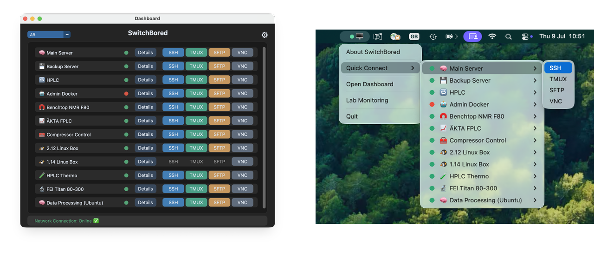

# SwitchBored

A macOS menu-bar app for monitoring and connecting to the machines you manage.

SwitchBored sits in your menu bar, keeps an eye on the machines you care about,
and gets you onto them fast — SSH, SFTP, tmux, or VNC in one click. A separate
dashboard window gives you live status, per-machine details, and (optionally)
remote service control and log viewing over SSH.

## Features

- **Menu bar quick-connect** — every machine gets a submenu with its enabled
  connection types (SSH / TMUX / SFTP / VNC) and a live online/offline dot.
- **Dashboard** — a resizable window listing all machines with latency,
  group filtering, and one-click connections.
- **Machine details** — live ping, and with *Sysadmin Features* enabled:
  systemd service status/start/stop/restart, remote log viewing with search,
  and custom admin commands.
- **SSH key deployment** — generate an ed25519 key and push it to all
  reachable machines with `ssh-copy-id` in one guided terminal session.
- **Connectivity heartbeat** — optional periodic check against a reference
  server (e.g. `1.1.1.1`) so you can tell "machine down" from "network down".
- **Offline notifications** — opt in per machine to get a macOS notification
  when it has been unreachable for 30 seconds while the reference server is
  still reachable (so it's the machine that's down, not your network).
  Requires the reference server check and the bundled app.
- **Custom menu shortcuts** — pin up to three entries to the menu bar menu:
  web links, app launchers (a fresh window of e.g. iTerm or VS Code), or
  shell commands.
- **Plugins** — drop a Python file into `plugins/` to add your own menu items
  and background monitors (see [Writing plugins](#writing-plugins)).

<p align="center">
  
  <br>
  <em>The dashboard — live status, group filtering, and one-click connections — and Quick Connect from the menu bar.</em>
</p>

## Requirements

- macOS (the app uses AppleScript, the menu bar, and macOS app paths)
- Python 3.9+
- Helper apps, all optional and configurable in Settings:
  - Terminal.app (default) or [iTerm2](https://iterm2.com/) for SSH/tmux
  - [Cyberduck](https://cyberduck.io/) or [FileZilla](https://filezilla-project.org/) for SFTP
  - [RealVNC Viewer](https://www.realvnc.com/en/connect/download/viewer/macos/) for VNC

## Installation

### Option 1 — Download the app (recommended)

Grab the latest `SwitchBored.zip` from the
[Releases page](https://github.com/jtolchard/SwitchBored/releases/latest),
unzip it, and drag `SwitchBored.app` into `/Applications`. The bundled app
requires an Apple-silicon Mac running macOS 11 (Big Sur) or later; Intel
users can run from source.

> **First launch:** the app is not notarized by Apple, so macOS may refuse to
> open it. Go to System Settings → Privacy & Security and click
> **Open Anyway**, or clear the quarantine flag from a terminal:
> `xattr -dc /Applications/SwitchBored.app`

### Option 2 — Run from source

```bash
git clone https://github.com/jtolchard/SwitchBored.git
cd SwitchBored
pip3 install -r requirements.txt
python3 console.py
```

Either way, the menu bar icon appears immediately, and on the very first
launch the dashboard opens by itself. Add machines via the dashboard's
⚙ Settings → Machines tab. On later launches, open the dashboard from the
menu — or enable "Open Dashboard on Startup" in Settings.

> **Note on status checks:** machine status is checked with ICMP ping first.
> If ping is unavailable (unprivileged raw sockets) or blocked by a firewall,
> SwitchBored falls back to timing a TCP connection to the machine's SSH port,
> so reachable machines still show as online.

## Updates

The app checks GitHub once a day for a new release and offers to install
anything new. You can also review what's available at any time in the
dashboard's ⚙ Settings → **Updates** tab, which checks on opening and shows
the release notes. When you're running the bundled app, updates download and
install in place — the app swaps itself for the new version and relaunches.
Your settings and installed plugins are untouched, because they live outside
the bundle (see below). When running from source, the update prompt just
points you at the release page; update with `git pull`.

## Where your data lives

Everything SwitchBored saves is in
`~/Library/Application Support/SwitchBored/`:

- `sysadmin_settings.json` — all settings and machines (export/import from
  the Machines tab in Settings; run with `--test` to use a separate file)
- `plugins/` — plugins you've installed
- debug logs and updater state

Settings → Danger Zone → **Reset All Settings…** deletes the saved settings
and restarts the app with defaults (installed plugins are kept). It requires
typed confirmation.

## Sysadmin features

Enable *Sysadmin Features* in Settings → Advanced to unlock, per machine:

- an **admin username** used for privileged SSH operations
- **tracked services** — systemd units shown with live status and
  START/STOP/RESTART buttons in the details window
- **log file paths** — viewable (with search) in a built-in viewer
- **custom admin commands** — named one-liners run over SSH

All remote operations use non-interactive SSH (`BatchMode=yes`), so key-based
authentication must already be set up — the SSH Key Deployment assistant in
Settings can do this for you.

## Writing plugins

Plugins are single Python files. Install them via Settings → Plugins →
*Install Plugin (.py)*, toggle them on, and restart when prompted. Installed
plugins are copied to `~/Library/Application Support/SwitchBored/plugins/`,
so they survive app updates; the examples bundled with the app (like the
template below) live in the repo's `plugins/` directory. A fully commented
example lives in [`plugins/menu_template.py`](plugins/menu_template.py) —
copying it is the fastest way to start.

### The minimum

A plugin is a module that defines a `Plugin` class taking the shared `core`
object:

```python
import rumps

class Plugin:
    def __init__(self, core):
        self.core = core

    def on_menu_build(self, app):
        item = rumps.MenuItem("Hello from my plugin", callback=self.say_hi)
        app.menu.add(item)

    def say_hi(self, sender):
        rumps.alert("Hi!")
```

### Lifecycle hooks

All hooks are optional. The host calls them if they exist:

| Hook | When it runs |
| --- | --- |
| `on_console_init(app)` | Once, after the menu-bar app finishes starting. |
| `on_menu_build(app)` | Every time the menu is rebuilt (startup, settings changes). Add your menu items here — the menu is cleared before each rebuild, so re-adding is expected. |
| `start(menu_item)` | Alternative to `on_menu_build`: the host creates a submenu for you under a shared "Plugins" menu and passes it in. |
| `stop()` | On app restart or quit. Stop your threads and timers here. |
| `on_machine_editor(editor, machine, frame)` | When the machine editor opens (sysadmin mode). Pack per-machine controls into `frame`; keep state on `editor`. |
| `on_machine_editor_save(editor, machine)` | When the machine is saved. Commit your editor state to the machine dict here — cancelling skips it. |
| `on_machine_details(window, machine, frame)` | When a machine's details window opens. Add status displays or actions; an `after()` loop guarded by `winfo_exists()` self-terminates on close. |

### Settings

Define a module-level `get_settings_schema()` to describe your configuration.
The plugin manager uses it to seed editable JSON in the Settings window:

```python
def get_settings_schema():
    return {
        "enabled":    {"type": "bool", "default": True, "label": "Enable plugin"},
        "interval_s": {"type": "int",  "default": 60,   "label": "Polling interval (s)"},
    }
```

Read your saved values back at runtime from
`core.settings["plugins"]["config"]["<your_module_name>"]` — see `_cfg()` in
the template for a helper that merges saved values with schema defaults.

### Useful core methods

- `core.log(category, message)` — write to the debug console/log
  (visible when Debug Mode is on).
- `core.check_status(address, timeout=1.0, port=None)` — ping (with TCP
  fallback); returns latency in seconds or `None`.
- `core.run_ssh_command(machine, command, timeout=5)` — run a remote command;
  returns `(ok, output)` where `ok` is `False` on connection failure.

### Threading rules

Menu callbacks and `rumps.Timer` callbacks run on the main thread — do slow
work (network, SSH) on your own thread and only push results into menu items
from a timer, as the template demonstrates. Always honour `stop()` so
restarts stay clean.

## Building a standalone SwitchBored.app

The app builds with [py2app](https://py2app.readthedocs.io/) using the
included [`setup.py`](setup.py) — it reads the app name and version from
`version.py` and applies the icon automatically.

Two environment rules matter:

- **For release builds, use the [python.org installer](https://www.python.org/downloads/macos/)**
  (the "macOS 64-bit universal2" package). Its binaries target macOS 10.13+,
  so the bundle runs on older systems. Homebrew Python also builds a working
  app, but its libraries are compiled for the macOS version of the build
  machine — the bundle then refuses to launch anywhere older ("Fatal Error"
  at startup). Conda/miniforge Python doesn't work at all (missing libraries
  at runtime).
- **Build from a clean virtual environment** containing only the app's
  requirements, so py2app's dependency scan doesn't try to walk every
  package on your system.

```bash
/usr/local/bin/python3.13 -m venv .venv        # python.org's interpreter
.venv/bin/pip install -r requirements.txt py2app
.venv/bin/python setup.py py2app               # → dist/SwitchBored.app
```

Before publishing, confirm the bundle's minimum macOS is what you expect:

```bash
vtool -show-build dist/SwitchBored.app/Contents/MacOS/python | grep minos
```

The dashboard and About windows are child processes launched by the app
re-invoking itself with internal `--dashboard` / `--about` flags, which
works identically from source and inside a bundle — no extra configuration
needed.

The app icon is `icon.icns`, generated from the 1024×1024 `icon.png`. To
regenerate it after changing the PNG:

```bash
./make_icns.sh                       # icon.png -> icon.icns
./make_icns.sh input.png output.icns # or with explicit paths
```

### Publishing a release

The built bundle is distributed as a GitHub Release asset, never committed
to the repository. The in-app updater looks for the latest published release
whose tag parses as a version (`v1.3`, `v1.3.1`, …) with a zip asset whose
name contains "SwitchBored":

```bash
cd dist
ditto -c -k --keepParent SwitchBored.app SwitchBored-1.3.zip
# then: create a GitHub release tagged v1.3 and attach SwitchBored-1.3.zip
```

`ditto` (rather than a plain `zip`) preserves the bundle's permissions and
metadata, and matches how the updater unpacks it on the other end.

## License

MIT — see [LICENSE](LICENSE).

## Author

[James Tolchard](https://www.linkedin.com/in/jamestolchard/)
